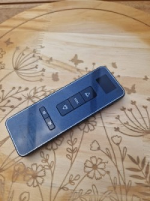

# Gumax RF Bridge
Control Gumax roller shutters / awnings from Home Assistant via an ESP32 + CC1101 RF module.
The custom integration will allow the creation of a new virtual remote or allow you to use your existing one.
The integration allows you control over all 16 channels and the CC broadcast channel.



This integration is built for Home Assistant systems using the Gumax RF remote shown above.

---

## Requirements

### Hardware
| Component | Specification |
|---|---|
| Microcontroller | ESP32 DevKit (or compatible) |
| RF module | CC1101 (433.92 MHz) |
| Connection | Jumper wires / breadboard or soldered |

### Software
- [ESPHome](https://esphome.io/) (CLI or HA add-on)
- Home Assistant 2026.1 or newer
- This repository

---

## Step 1 — Wiring ESP32 ↔ CC1101

Connect the CC1101 module to the ESP32 as follows:

| CC1101 pin | ESP32 GPIO | Function |
|---|---|---|
| CLK / SCK | GPIO18 | SPI clock |
| MOSI / SI | GPIO23 | SPI data out |
| MISO / SO | GPIO19 | SPI data in |
| CS / CSN | GPIO5 | SPI chip select |
| GDO0 | GPIO26 | Transmit data |
| GDO2 | GPIO25 | Receive data |
| VCC | 3.3 V | Power |
| GND | GND | Ground |

> **Note:** Use 3.3 V power for the CC1101. The module is **not** 5 V tolerant.

---

## Step 2 — Create ESPHome secrets

Create (or update) the file `secrets.yaml` in your ESPHome configuration directory:

```yaml
wifi_ssid: "YourWifiName"
wifi_password: "YourWifiPassword"
gumax_api_key: "GenerateABase64Key=="   # esphome generate-api-key
gumax_ota_password: "ChooseAnOTAPassword"
gumax_ap_password: "FallbackHotspotPassword"
```

Generate an API key via the ESPHome CLI:
```bash
esphome generate-api-key
```

---

## Step 3 — Flash the ESP32 with ESPHome

Copy `esphome/gumax_rf_bridge.yaml` to your ESPHome configuration directory.

Flash the firmware via USB:
```bash
esphome run esphome/gumax_rf_bridge.yaml
```

Or via the ESPHome add-on in Home Assistant:
1. Go to **ESPHome** → click **+ New device**
2. Import `gumax_rf_bridge.yaml` or paste the contents manually
3. Click **Install** → **Plug into this computer**

After flashing, the ESP32 automatically connects to your Wi-Fi. Check the logs — you should see `[I] (esphome)` messages without errors.

---

## Step 4 — Add the ESP32 to Home Assistant

1. Open Home Assistant
2. Go to **Settings → Devices & services**
3. The ESP32 appears automatically as a discovered integration (**ESPHome — gumax-rf**)
4. Click **Configure** and enter the API key you set in `secrets.yaml`

---

## Step 5 — Install the custom component

### Via HACS (recommended)
1. Install [HACS](https://hacs.xyz/) if you haven't already
2. Go to **HACS → Integrations → ⋮ → Custom repositories**
3. Add the URL of this repository as type **Integration**
4. Search for **Gumax RF** and install
5. Restart Home Assistant

### Manually
Copy the folder `custom_components/gumax_rf/` to your HA configuration directory:

```
<config>/
  custom_components/
    gumax_rf/
      __init__.py
      _calibration_flow.py
      _protocol.py
      binary_sensor.py
      config_flow.py
      const.py
      cover.py
      helpers.py
      icon.png
      manifest.json
      repairs.py
      sensor.py
      strings.json
      translations/
        nl.json
        en.json
        de.json
        fr.json
```

Then restart Home Assistant.

---

## Step 6 — Configure the Gumax RF integration

1. Go to **Settings → Devices & services → + Add integration**
2. Search for **Gumax RF** and click it
3. Select the ESPHome node (auto-detected if the CC1101 bridge is online), then press a button on your existing Gumax remote — the integration captures the Device ID automatically

   There is no manual "enter a Device ID" option. The checksum each remote sends depends on a per-remote constant that can't be typed in or guessed — it has to be learned from a live signal (see [Calibration](#calibration) below).
4. Calibrate the remote: press a button on channel **K1**, then **K2**, then **K9** when prompted. This takes a few seconds and only needs to be done once per remote.
5. Choose a channel name prefix and click **Submit**

Home Assistant will create **16 channel entities** (K1–K16) plus one **CC (broadcast) entity** for all channels simultaneously.

---

## Calibration

Every physical Gumax remote bakes a device-specific constant into its checksum. It cannot be derived from the Device ID, so the integration learns it directly from three live captures (K1, K2, K9) during setup.

After calibrating, the integration double-checks its own math and shows a pass/fail result. If a channel doesn't check out, that points to a bug in the integration rather than a problem with your remote — the screen will link straight to opening a GitHub issue. You'll also be offered the option to share your (anonymized) capture data in the project's [GitHub Discussion](https://github.com/JimKoene/gumax-rf/discussions/5), to help improve checksum support for other remotes. This is entirely optional and nothing is sent automatically.

If you're upgrading from a version of this integration that predates calibration, your existing entries keep working unchanged. Home Assistant will show a **Repair** notice (Settings → Repairs) inviting you to recalibrate — click **Fix** and it walks you through the same K1/K2/K9 capture, in place.

---

## Viewing raw pulse timings

Each configured entry exposes the raw pulse timings for any channel and command directly from the integration page.

1. Go to **Settings → Devices & services → Gumax RF**
2. Click the cogwheel next to the entry → **Configure**
3. Select a channel (K1–K16 or CC) and click **Next**
4. The raw pulse timings for **up**, **down**, and **stop** are shown on screen and can be selected and copied

This is useful if you want to transmit commands from another tool (e.g. ESPHome `remote_transmitter.transmit_raw`, Node-RED, or a script) without going through the integration.

---

## Device ID

The Device ID is a 32-bit hex value (e.g. `A1B2C3D4`) that identifies a remote. It cannot be read from a sticker — it must be captured from an existing remote using the setup flow, which also calibrates the checksum for that remote (see [Calibration](#calibration)).

If you have multiple remotes or systems, add the integration multiple times with a different Device ID for each.

---

## Entities overview

| Entity | Description |
|---|---|
| `cover.gumax_rf_k1` – `cover.gumax_rf_k16` | Individual channels 1–16 |
| `cover.gumax_rf_cc` | Broadcast — controls all paired channels simultaneously |

Every entity supports the **Open**, **Close**, and **Stop** actions.

> **Note:** The position of the shutter is unknown (one-way RF). Entities use `assumed_state`, meaning HA remembers the last sent command as the state, but it also does not block the buttons.

---

## Troubleshooting

### ESP32 not found in HA
- Check that the ESP32 is connected to Wi-Fi (check the ESPHome logs)
- Make sure the API key in HA matches the one in `secrets.yaml`
- Wait 1–2 minutes after the ESP32 boots

### No ESPHome node available in the configuration form
- Check that the ESPHome integration has added the ESP32 correctly
- Restart Home Assistant after installing the custom component

### Shutter does not respond
- Check the wiring (especially GDO0 on GPIO26, GDO2 on GPIO25, and CS on GPIO5)
- Verify the Device ID — a wrong ID means the signal will be ignored by the motor
- Keep the ESP32 and the motor receiver close together during initial tests
- Check the ESPHome logs via **ESPHome → gumax-rf → Logs**

### Device ID was learned successfully, but sending commands fails

If the **Learn** flow worked (the Device ID was captured from your remote), the ESP32 and CC1101 are physically working and connected to HA. A `transmit_raw not found` error in the HA logs means the `transmit_raw` action is not exposed by ESPHome — typically because the `api.actions` block is missing or was removed from the YAML.

#### Possible solution 1 — Verify non_blocking is set to false

The default configuration ships with `non_blocking: false`, which is safe on both single-core (ESP32-C3) and dual-core boards. On single-core boards, `non_blocking: true` can cause a timing race where the first RF pulse fires before `cc1101.begin_tx` finishes its SPI transaction, so the CC1101 is not yet in TX mode when data arrives.

Make sure your config has:

```yaml
remote_transmitter:
  id: rf_tx
  pin:
    number: GPIO26   # adjust to your wiring
  carrier_duty_percent: 100%
  non_blocking: false
```

Reflash and test. The ESP main loop will wait for the transmission to finish (~100 ms per repeat) but this delay is not visible to Home Assistant.

> **Note:** On dual-core boards (standard ESP32 DevKit) you may set `non_blocking: true` for a marginally more responsive main loop, but it is not necessary.

#### Possible solution 2 — Isolate the transmitter

To check whether the CC1101 is getting stuck switching between RX and TX mode, temporarily comment out the entire `remote_receiver` block:

```yaml
# remote_receiver:
#   id: rf_rx
#   ...
```

Also comment out the `on_transmit` / `on_complete` callbacks so the CC1101 stays in transmit mode:

```yaml
remote_transmitter:
  id: rf_tx
  pin:
    number: GPIO26
  carrier_duty_percent: 100%
  non_blocking: true
  # on_transmit:
  #   then:
  #     - cc1101.begin_tx: cc1101_chip
  # on_complete:
  #   then:
  #     - cc1101.begin_rx: cc1101_chip
```

Reflash the device and try sending a command from Home Assistant. If the shutter responds, the CC1101 was getting stuck switching between RX and TX mode.

If you have no plans to add more remotes in the future, you can leave the receiver and the mode-switch callbacks commented out permanently. The receiver is only needed for the setup flow (Device ID capture + K1/K2/K9 calibration) and the diagnostic "Capture and analyse signal" option — once all your remotes are configured and calibrated, it serves no purpose. Keep it available if you might add or recalibrate a remote later.

---

## Technical details
- Frequency: 433.92 MHz OOK
- Channels: 1–16 (K1–K16) + CC broadcast
- Each command is transmitted 3× for reliable reception
- Hardware: ESP32 with CC1101 via SPI
- RF framework: ESPHome `remote_transmitter` + `remote_receiver` + `cc1101` external component
